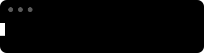

<div align="center">


<br>



</div>

<br>

```bash
ruan@uffs ~ % whoami
> Ruan Arthur (aka 2ras)
> Classe: Estudante de Ciência da Computação — UFFS, SC
> Stack: HTML · CSS · JavaScript · Python · React · Node · Supabase
> Perks: gosto por jogos + fraco por qualquer coisa visual
> Status: [■■■■■■■□□□] aprendendo sem parar
```

<br>

## 🎒 Inventário

<p align="center">
  
  
  
  
  
  
  
  
  
</p>

<br>

## 🔥 Combo atual

<p align="center">
  
</p>

<br>

<!--
🚀 Projetos em destaque — troque pelos seus repositórios reais
## 🚀 Projetos em destaque

| Projeto | Descrição | Stack |
|---|---|---|
| [nome-do-projeto](https://github.com/2rascode/nome-do-projeto) | Descrição curta do projeto | HTML · CSS · JS |
-->

## 🌐 Redes sociais

<p align="center">
  <a href="mailto:bothruanarthur@gmail.com">
    
  </a>
  <a href="https://instagram.com/2ras_ruan" target="_blank">
    
  </a>
</p>

<p align="center">
  
</p>

<div align="center">

💡 *Dica de carregamento: código bom é aquele que funciona — código ótimo é aquele que também é bonito de se olhar.*

</div>
